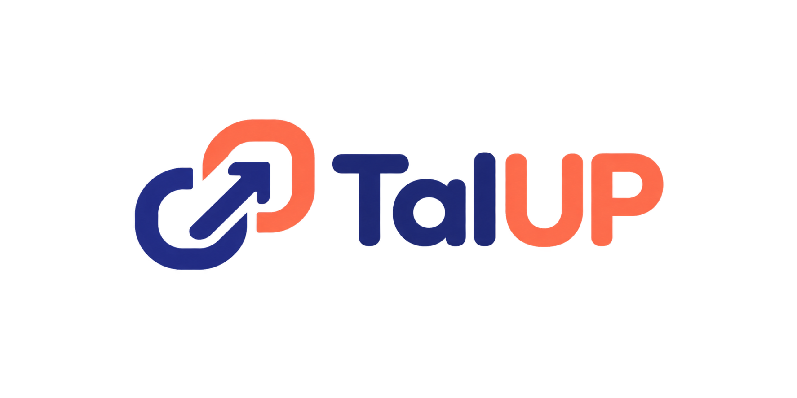
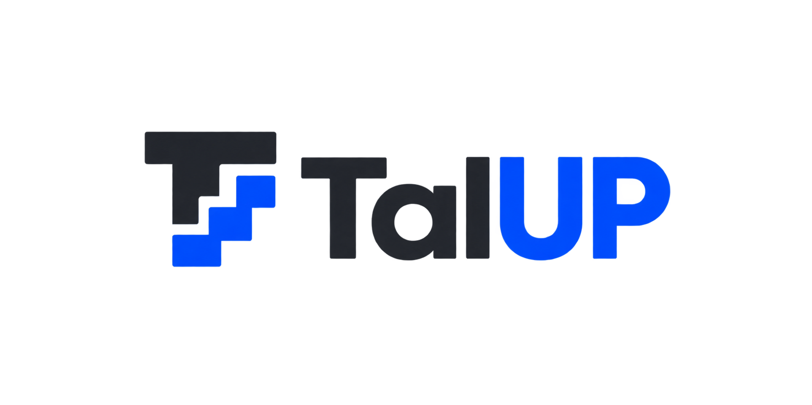
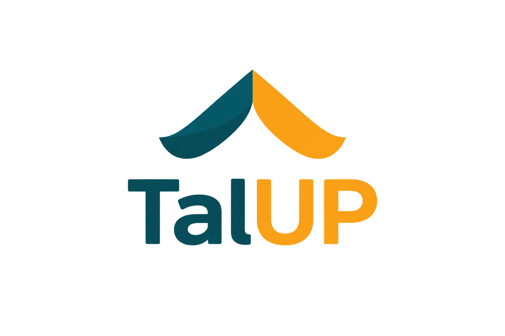
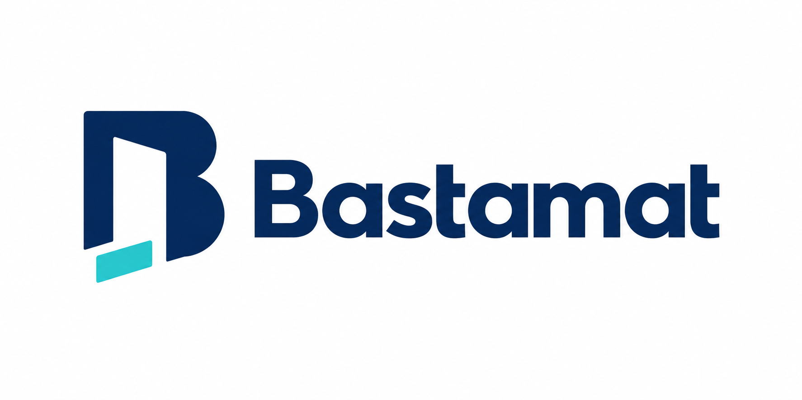
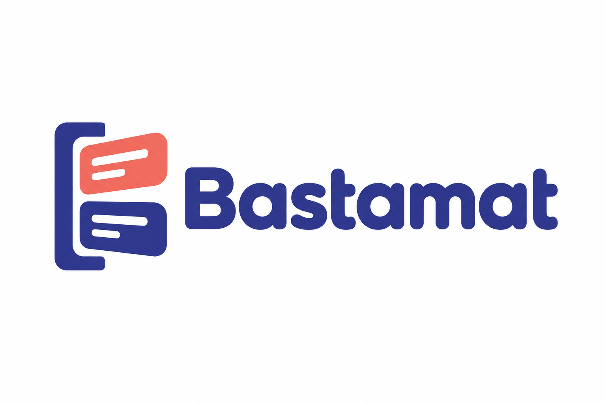
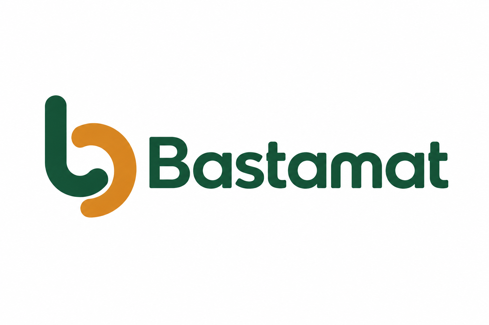
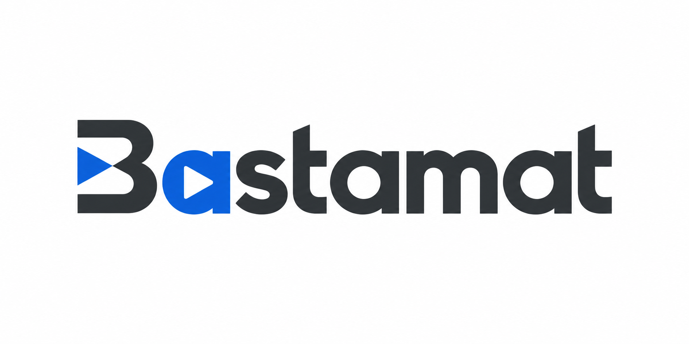
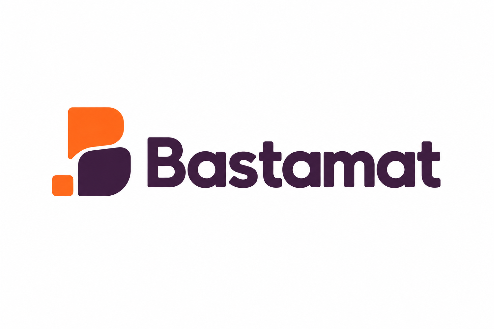

# Наброски логотипов TalUP и Bastamat

Все 10 изображений созданы встроенным генератором изображений OpenAI в ходе обсуждения бренда. Это растровые концепты, а не готовые векторные логотипы. Исходные PNG сохранены без изменений.

TalUP: пять изображений, включая первоначальный вариант со свечением и его замену без свечения. Bastamat: пять вариантов.

## TalUP: стрелка роста

## TalUP: связь бизнеса и студентов

## TalUP: ступени развития

## TalUP: совместный рост, первоначальный вариант со свечением

## TalUP: совместный рост, вариант без свечения

## Bastamat: дверь в букве B

## Bastamat: карточки заявок

## Bastamat: соединение сторон

## Bastamat: начало и запуск

## Bastamat: инициатива и рост

